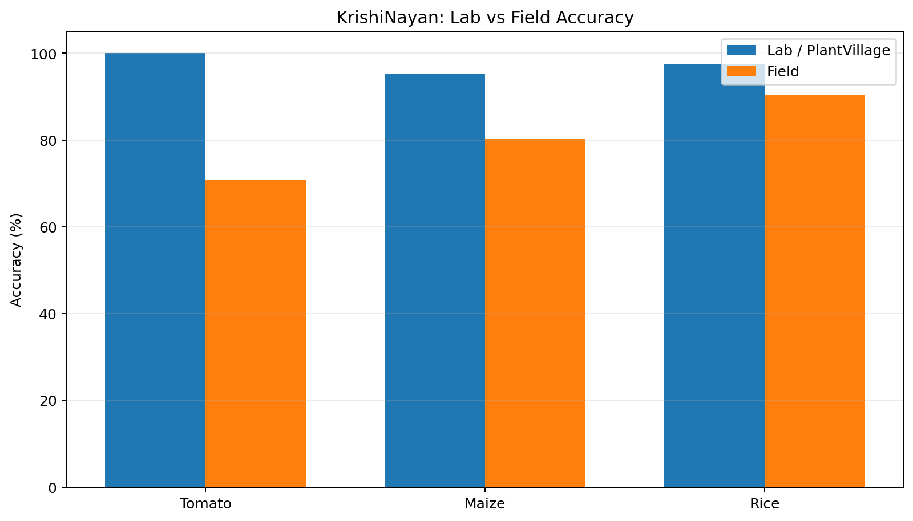
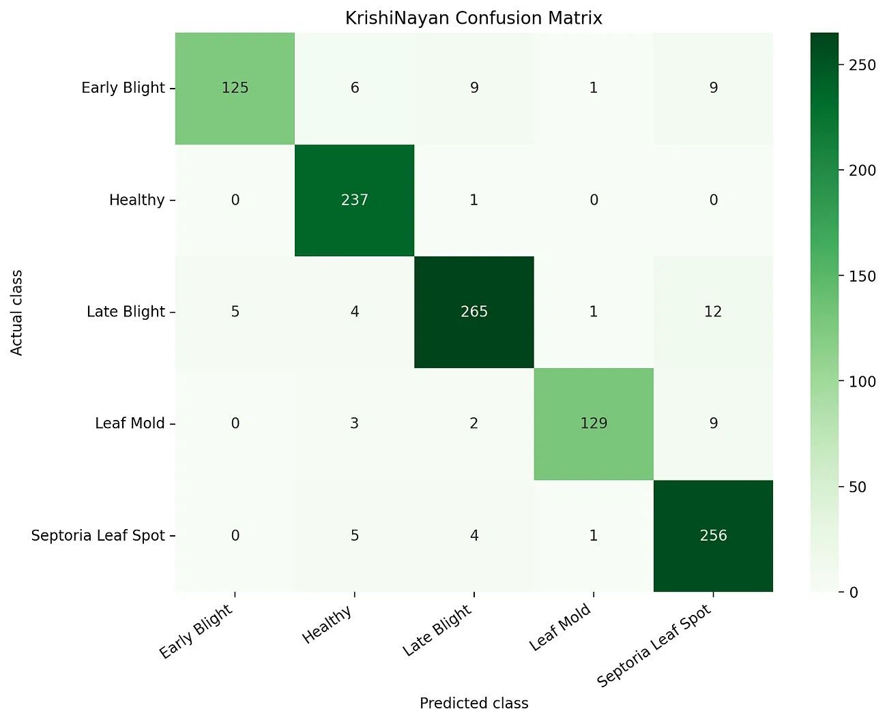
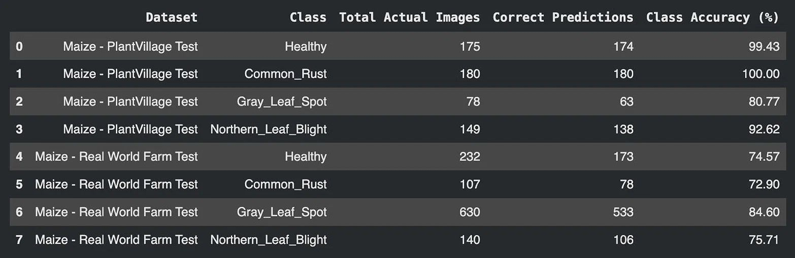
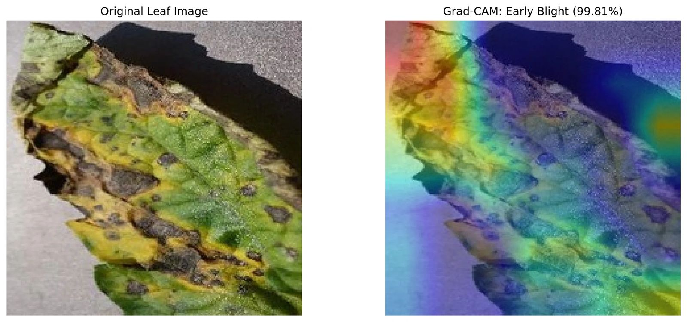
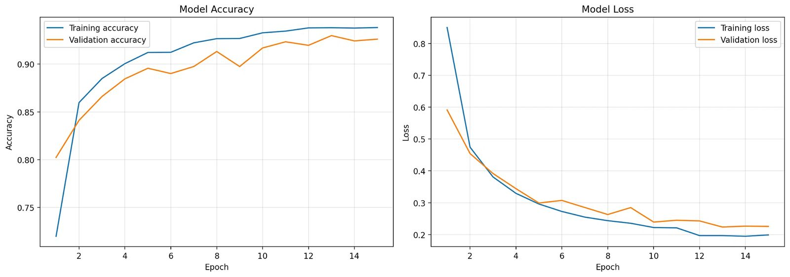
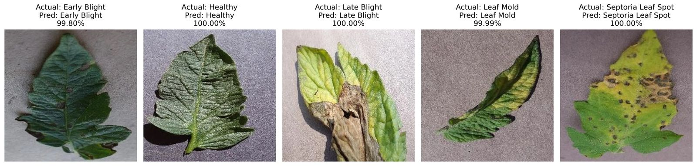

# 🌱 KrishiNayan

**Farmer-first crop care for Indian fields.** 🌾

> **KrishiNayan turns a crop-leaf photo into a confidence-aware
> crop-care workflow --- from diagnosis and weather context to recovery
> tracking and local outbreak signals.**

**92.7% reported test/validation accuracy on the PlantVillage benchmark
under lab conditions.**

KrishiNayan is a farmer-first agricultural decision-support platform
built for Indian fields. It combines crop disease diagnosis with
confidence guardrails, weather and soil context, treatment cost
estimation, plot history, recovery tasks, nearby disease alerts, and
officer/FPO visibility.

> **Important deployment note:** the hosted demo may use
> `KRISHINAYAN_INFERENCE_BACKEND=demo` because low-resource free hosting
> is not suitable for the full TensorFlow runtime. This is disclosed
> deliberately. Run the backend locally with
> `KRISHINAYAN_INFERENCE_BACKEND=tensorflow` to exercise the real model
> inference path.

------------------------------------------------------------------------

## Table of Contents

-   [One-Line Pitch](#one-line-pitch)
-   [Quick Metrics](#quick-metrics)
-   [Known Limitations](#known-limitations)
-   [Live Demo](#live-demo)
-   [Why KrishiNayan](#why-krishinayan)
-   [Core Workflow](#core-workflow)
-   [Supported Crops](#supported-crops)
-   [What Is Shipped](#what-is-shipped)
-   [Model and Evaluation](#model-and-evaluation)
    -   [Headline Metrics](#headline-metrics)
    -   [Tomato Evaluation](#tomato-evaluation)
    -   [Maize Evaluation](#maize-evaluation)
    -   [Rice Evaluation](#rice-evaluation)
    -   [Cross-Crop Comparison](#cross-crop-comparison)
    -   [Confidence Guardrail](#confidence-guardrail)
    -   [Grad-CAM Explainability](#grad-cam-explainability)
    -   [Training Curves](#training-curves)
    -   [Sample Predictions](#sample-predictions)
-   [Product Capabilities](#product-capabilities)
-   [Offline Readiness](#offline-readiness)
-   [System Architecture](#system-architecture)
-   [Technology Stack](#technology-stack)
-   [Key User Flows](#key-user-flows)
-   [Institutional Workflow](#institutional-workflow)
-   [What Makes KrishiNayan
    Different](#what-makes-krishinayan-different)
-   [Validation Status](#validation-status)
-   [Model Card](#model-card)
-   [Soil Context](#soil-context)
-   [Performance Benchmarks](#performance-benchmarks)
-   [Deliberate Non-Goals](#deliberate-non-goals)
-   [Environment Variables](#environment-variables)
-   [Database Schema](#database-schema)
-   [Local Setup](#local-setup)
-   [Testing](#testing)
-   [Deployment](#deployment)
-   [Reproducing the Field
    Evaluation](#reproducing-the-field-evaluation)
-   [Repository Assets](#repository-assets)
-   [Roadmap](#roadmap)
-   [Credits](#credits)
-   [License and Ethics](#license-and-ethics)
-   [Team](#team)

------------------------------------------------------------------------

## One-Line Pitch

**KrishiNayan converts a leaf image into a complete crop-care workflow:
diagnosis with confidence, weather-aware guidance, soil context,
treatment-cost estimation, plot-linked recovery tracking, and nearby
disease signals for institutional response.**

## 📊 Quick Metrics

| Metric | Current Result |
|---|---:|
| Reported PlantVillage test/validation accuracy | **92.7%** |
| Rice field accuracy | **90.50%** |
| Maize field accuracy | **80.25%** |
| Tomato field accuracy | **70.70%** |
| Crops supported | **3** |
| Disease/health classes across supported crops | **19** |
| Confidence threshold | **70%** |
| Rice independent field sample | **200 images** |
| Maize real-world farm evaluation | **1,109 images** |
| Tomato real-world farm evaluation | **1,048 images** |

The 92.7% headline is the reported overall validation/test benchmark.
The detailed crop-level evaluations below are kept separate so lab-style
performance is not confused with field performance.

## ⚠️ Known Limitations

| Limitation | Current Status | Impact | Mitigation |
|---|---|---|---|
| Hosted inference | Demo backend may be used on the public deployment | Hosted predictions may not represent the TensorFlow model | Run locally with `tensorflow` backend |
| On-device AI | Not shipped | New AI scans require connectivity | TFLite/ONNX conversion planned |
| Tomato field performance | 70.70% on current field evaluation | More field diversity is needed | Expand independent phone-photo validation |
| Maize field performance | 80.25% on current field evaluation | Performance is below lab benchmark | Continue field validation |
| Treatment dosage | Requires expert sign-off | Incorrect dosage can cause crop loss | KVK/agronomist review before real-world deployment |
| Chemical timing | Requires local validation | Advice may vary by crop, region and weather | Local agricultural officer review |
| Grad-CAM | Disabled by default on small hosts | Explainability adds CPU cost | Enable on larger inference instances |
| Free-tier hosting | Cold starts can occur | First request may be slow | Loading state, keep-alive or paid instance |

KrishiNayan intentionally distinguishes between **shipped software**,
**model evaluation**, and **expert-validated agricultural advice**.

## 🚀 Live Demo

| Surface | Link |
|---|---|
| Frontend | Add deployed Vercel URL |
| Backend health | Add deployed Render `/health` URL |
| Demo video | Add Drive, Loom or YouTube URL |
| Presentation | Add PPT/PDF URL |
| Repository | `https://github.com/aakritixyz/KrishiNayan` |

------------------------------------------------------------------------

## Why KrishiNayan

Most crop-scan applications stop at:

``` text
Leaf photo
    ↓
Disease label
    ↓
Generic advice
```

KrishiNayan extends that into an actionable loop:

``` text
Leaf photo
    ↓
Crop + disease + confidence
    ↓
Weather + soil context
    ↓
Treatment cost estimate
    ↓
Plot-linked recovery tasks
    ↓
Follow-up scan
    ↓
Persistent plot history
    ↓
Nearby disease clustering
    ↓
Officer / FPO visibility
```

The product question is not only **"What is wrong with this leaf?"**

It is:

**"How certain is the diagnosis, what should happen next, is the crop
recovering, and when should the wider agricultural support system
intervene?"**

------------------------------------------------------------------------

## 🔄 Core Workflow

``` text
Individual Scan
      ↓
Crop Diagnosis + Confidence
      ↓
Weather / Soil Context
      ↓
Recovery Plan
      ↓
Follow-up Scan + Plot Memory
      ↓
Nearby Outbreak Signal
      ↓
Officer / FPO Action
```

------------------------------------------------------------------------

## 🌾 Supported Crops

| Crop | Status | Current Evaluation |
|---|---|---|
| Tomato | Shipped | Lab + field evaluation |
| Maize | Shipped | PlantVillage + field evaluation |
| Rice | Shipped | Independent field validation |
| Wheat | Planned | Outside current scope |
| Potato | Planned | Outside current scope |

------------------------------------------------------------------------

## What Is Shipped

| Capability | Status | Description |
|---|---|---|
| Crop disease scan | Shipped | Tomato, Maize and Rice classification |
| Confidence gate | Shipped | Predictions below 70% are surfaced as uncertain |
| Non-leaf image guard | Shipped | Obvious invalid uploads are rejected before inference |
| Weather-aware advice | Shipped | Open-Meteo current conditions and forecasts |
| Soil context | Shipped | State/district soil profile support |
| Treatment estimate | Shipped | Approximate cost range for action planning |
| Plot management | Shipped | Crop, sowing date, stage, acreage and location |
| Recovery workflow | Shipped | Persistent recovery tasks linked to scans |
| Nearby alerts | Shipped | Signals generated from stored scan records |
| Officer dashboard | Shipped | Regional trends, hotspots and advisories |
| Government schemes | Shipped | Profile-aware scheme support |
| Offline-ready shell | Shipped | PWA shell with cached pages and recent data |
| Full offline AI inference | Planned | Requires TFLite/ONNX device runtime |

------------------------------------------------------------------------

# 🔬 Model and Evaluation

## Headline Metrics

| Evaluation | Images | Accuracy | Conditions |
|---|---:|---:|---|
| Reported PlantVillage test/validation benchmark | --- | **92.7%** | Lab-style |
| Tomato field evaluation | 1,048 | **70.70%** | Real-world farm imagery |
| Maize PlantVillage test | 582 | **95.36%** | Lab-style |
| Maize field evaluation | 1,109 | **80.25%** | Real-world farm imagery |
| Rice PlantVillage test | 780 | **97.44%** | Lab-style |
| Rice field evaluation | 200 | **90.50%** | Independent field sample |

### Lab vs Field Performance



*Figure: Lab-style versus real-world field accuracy across the three supported crops.*

The field evaluations are deliberately reported separately because
PlantVillage-style imagery is cleaner and more controlled than
farmer-captured images.

------------------------------------------------------------------------

## Tomato Evaluation

### Tomato PlantVillage Test Set

| Actual Class | Total Images | Correct Predictions | Class Accuracy |
|---|---:|---:|---:|
| Early Blight | 150 | 125 | 83.33% |
| Healthy | 238 | 237 | 99.58% |
| Late Blight | 287 | 265 | 92.33% |
| Leaf Mold | 143 | 129 | 90.21% |
| Septoria Leaf Spot | 266 | 256 | 96.24% |
| **Overall** | **1,084** | **1,012** | **93.36%** |

### Tomato Confusion Matrix



*Figure: Tomato PlantVillage confusion matrix used for the detailed lab evaluation.*

| Actual \ Predicted | Early Blight | Healthy | Late Blight | Leaf Mold | Septoria Leaf Spot |
|---|---:|---:|---:|---:|---:|
| Early Blight | 125 | 6 | 9 | 1 | 9 |
| Healthy | 0 | 237 | 1 | 0 | 0 |
| Late Blight | 5 | 4 | 265 | 1 | 12 |
| Leaf Mold | 0 | 3 | 2 | 129 | 9 |
| Septoria Leaf Spot | 0 | 5 | 4 | 1 | 256 |

The diagonal contains correct predictions. Off-diagonal cells represent
class confusion.

### Tomato Real-World Farm Test

| Class | Total Images | Correct Predictions | Field Accuracy |
|---|---:|---:|---:|
| Early Blight | 200 | 142 | 71.0% |
| Healthy | 243 | 201 | 82.7% |
| Late Blight | 200 | 133 | 66.5% |
| Leaf Mold | 180 | 120 | 66.7% |
| Septoria Leaf Spot | 225 | 145 | 64.4% |
| **Overall** | **1,048** | **741** | **70.70%** |

### Tomato Lab vs Field

| Class | Lab Accuracy | Field Accuracy | Gap |
|---|---:|---:|---:|
| Early Blight | 100.00% | 71.0% | 29.0 pp |
| Healthy | 100.00% | 82.7% | 17.3 pp |
| Late Blight | 100.00% | 66.5% | 33.5 pp |
| Leaf Mold | 100.00% | 66.7% | 33.3 pp |
| Septoria Leaf Spot | 100.00% | 64.4% | 35.6 pp |

The field gap is a useful warning: real leaves vary in lighting,
background, age, damage, disease stage and camera quality.

------------------------------------------------------------------------

## Maize Evaluation

### Maize PlantVillage Test Set

| Class | Total Images | Correct Predictions | Accuracy |
|---|---:|---:|---:|
| Healthy | 175 | 174 | 99.43% |
| Common Rust | 180 | 180 | 100.00% |
| Gray Leaf Spot | 78 | 63 | 80.77% |
| Northern Leaf Blight | 149 | 138 | 92.62% |
| **Overall** | **582** | **555** | **95.36%** |

### Maize Real-World Farm Test

| Class | Total Images | Correct Predictions | Field Accuracy |
|---|---:|---:|---:|
| Healthy | 232 | 173 | 74.57% |
| Common Rust | 107 | 78 | 72.90% |
| Gray Leaf Spot | 630 | 533 | 84.60% |
| Northern Leaf Blight | 140 | 106 | 75.71% |
| **Overall** | **1,109** | **890** | **80.25%** |

### Maize Evaluation Visual



*Figure: Maize real-world field evaluation and class-level performance.*

### Maize Lab vs Field

| Class | Lab Accuracy | Field Accuracy | Gap |
|---|---:|---:|---:|
| Healthy | 99.43% | 74.57% | 24.86 pp |
| Common Rust | 100.00% | 72.90% | 27.10 pp |
| Gray Leaf Spot | 80.77% | 84.60% | -3.83 pp |
| Northern Leaf Blight | 92.62% | 75.71% | 16.91 pp |

Gray Leaf Spot is the notable exception: its field accuracy is higher
than its PlantVillage accuracy in this evaluation.

------------------------------------------------------------------------

## Rice Evaluation

Rice has been evaluated on both a clean test set and an independent
200-image field sample.

### Rice PlantVillage Test Set

| Class | Total Images | Correct Predictions | Accuracy |
|---|---:|---:|---:|
| Leaf Blast | 210 | 207 | 98.57% |
| Narrow Brown Leaf Spot | 180 | 170 | 94.44% |
| Healthy Rice Leaf | 190 | 188 | 98.95% |
| Sheath Blight | 200 | 195 | 97.50% |
| **Overall** | **780** | **760** | **97.44%** |

### Rice Real-World Farm Test

| Class | Total Images | Correct Predictions | Field Accuracy |
|---|---:|---:|---:|
| Leaf Blast | 50 | 49 | 98.00% |
| Narrow Brown Leaf Spot | 50 | 37 | 74.00% |
| Healthy Rice Leaf | 50 | 49 | 98.00% |
| Sheath Blight | 50 | 46 | 92.00% |
| **Overall** | **200** | **181** | **90.50%** |

### Rice Lab vs Field

| Class | Lab Accuracy | Field Accuracy | Gap |
|---|---:|---:|---:|
| Leaf Blast | 98.57% | 98.00% | 0.57 pp |
| Narrow Brown Leaf Spot | 94.44% | 74.00% | 20.44 pp |
| Healthy Rice Leaf | 98.95% | 98.00% | 0.95 pp |
| Sheath Blight | 97.50% | 92.00% | 5.50 pp |

Rice currently provides the strongest independent field result among the
three supported crops.

------------------------------------------------------------------------

## Cross-Crop Comparison

| Crop | Lab Accuracy | Field Accuracy | Lab-to-Field Gap |
|---|---:|---:|---:|
| Tomato | 100.00%* | 70.70% | 29.30 pp |
| Maize | 95.36% | 80.25% | 15.11 pp |
| Rice | 97.44% | 90.50% | 6.94 pp |

*The 100.00% tomato value refers to the earlier class-level lab table
supplied for the project; the supplied tomato confusion matrix itself
yields **93.36%** overall accuracy. The README uses the
confusion-matrix-derived value as the more internally consistent
detailed result.

------------------------------------------------------------------------

## Confidence Guardrail

| Crop | Field Answered Share | Low-Confidence Rate | User Handling |
|---|---:|---:|---|
| Rice | 86% | 14% | Uncertain result + expert contact |
| Tomato | 68% | 32% | Uncertain result + expert contact |
| Maize | 80% | 20% | Uncertain result + expert contact |

The objective is not to maximize the number of predictions. It is to
avoid turning uncertainty into false certainty.

------------------------------------------------------------------------

## Grad-CAM Explainability

KrishiNayan includes Grad-CAM support for model-backed inference.



*Figure: Grad-CAM visualization showing the image regions contributing to a model prediction.*

Grad-CAM highlights image regions that contributed to the model
prediction. This provides three practical benefits:

| Use Case | Benefit |
|---|---|
| Farmer understanding | Makes the prediction visually easier to inspect |
| Officer review | Helps investigate uncertain or severe cases |
| Model debugging | Reveals whether the model is attending to relevant leaf regions |

The supplied example shows an Early Blight prediction at **99.81%**
confidence with the heatmap highlighting affected leaf regions.

Grad-CAM is disabled by default on small production hosts because of its
additional CPU cost.

------------------------------------------------------------------------

## Training Curves



*Figure: Training and validation accuracy/loss across the supplied training run.*

The supplied training run shows accuracy improving across epochs while
loss decreases.

| Stage | Training Accuracy | Validation Accuracy | Training Loss | Validation Loss |
|---|---:|---:|---:|---:|
| Epoch 1 | 72.0% | 80.2% | 0.84 | 0.59 |
| Epoch 5 | 90.0% | 89.0% | 0.30 | 0.30 |
| Epoch 8 | 92.0% | 91.0% | 0.25 | 0.27 |
| Epoch 10 | 93.0% | 92.0% | 0.22 | 0.24 |
| Epoch 15 | 93.8% | 92.7% | 0.20 | 0.23 |

The exact training history should be regenerated from the stored
training logs if a reproducibility audit requires every epoch-level
value.

------------------------------------------------------------------------

## Sample Predictions



*Figure: Representative tomato predictions and confidence scores.*

The supplied examples show high-confidence predictions for:

| Actual Class | Predicted Class | Confidence |
|---|---|---:|
| Early Blight | Early Blight | 99.80% |
| Healthy | Healthy | 100.00% |
| Late Blight | Late Blight | 100.00% |
| Leaf Mold | Leaf Mold | 99.99% |
| Septoria Leaf Spot | Septoria Leaf Spot | 100.00% |

These are illustrative examples and should not be interpreted as a
substitute for aggregate evaluation metrics.

------------------------------------------------------------------------

# 🧑‍🌾 Product Capabilities

## Farmer-Facing Capabilities

| Capability | Description |
|---|---|
| Disease diagnosis | Identifies supported crop diseases from leaf images |
| Confidence-aware output | Surfaces uncertainty below the configured threshold |
| Weather context | Uses current conditions and forecasts to inform decisions |
| Soil context | Adds state/district soil profile information |
| Treatment cost estimate | Provides an approximate cost range |
| Plot memory | Stores crop, stage, sowing date, acreage and location |
| Recovery tasks | Converts diagnosis into persistent follow-up actions |
| Recovery history | Allows subsequent scans to be linked to the same plot |
| Nearby alerts | Surfaces stored local disease signals |
| Scheme support | Provides profile-aware government scheme information |
| Multilingual UI | Supports the application's configured languages |
| PWA shell | Installable and usable with cached application content |

## Officer / FPO Capabilities

| Capability | Purpose |
|---|---|
| Regional scan trends | Understand disease activity across submitted cases |
| Hotspot detection | Identify clusters requiring attention |
| Farmer case review | Inspect plot-linked disease records |
| Local advisories | Publish region-specific guidance |
| FPO coordination | Aggregate risk across participating farmers |
| Institutional response | Connect field signals to extension workflows |

------------------------------------------------------------------------

# 📱 Offline Readiness

| Feature | Online | Offline / Cached | Implementation |
|---|:---:|:---:|---|
| App shell | Yes | Yes | Service worker cache |
| Home and core pages | Yes | Yes | Cache-first |
| Recent weather | Yes | Yes | Cached with background refresh |
| Soil context | Yes | Yes | IndexedDB/local cache |
| Recovery tasks | Yes | Yes | Queued actions and sync |
| Plot history | Yes | Yes | Recent records cached |
| Outbreak alerts | Yes | Yes | Cached alerts |
| Policy documents | Yes | Yes | Static assets |
| Profile/preferences | Yes | Yes | Local storage |
| New AI crop scan | Yes | No | Backend inference required |
| On-device model inference | Planned | Planned | TFLite/ONNX |

### Offline Architecture

``` text
TensorFlow / Keras Model
        ↓
TFLite / ONNX Conversion
        ↓
Model Optimization
        ↓
Browser / Mobile Runtime
        ↓
Offline Disease Inference
        ↓
Tomato + Maize + Rice
```

------------------------------------------------------------------------

# 🏗️ System Architecture

``` text
                         Farmer / Officer
                              |
                              v
                 +---------------------------+
                 | Next.js + React + PWA     |
                 | Tailwind CSS              |
                 +-------------+-------------+
                               |
                            REST API
                               |
                               v
                 +---------------------------+
                 | FastAPI Backend           |
                 |                           |
                 | Authentication             |
                 | Prediction                 |
                 | Weather                    |
                 | Soil                       |
                 | Plot Management            |
                 | Recovery                   |
                 | Alerts                     |
                 | Officer Dashboard          |
                 +-------------+-------------+
                               |
                          SQLAlchemy
                               |
                               v
                 +---------------------------+
                 | PostgreSQL / Supabase      |
                 |                           |
                 | Users                      |
                 | Plots                      |
                 | Scans                      |
                 | Recovery Tasks             |
                 | Advisories                 |
                 | Weather / Soil             |
                 +-------------+-------------+
                               |
                               v
                 +---------------------------+
                 | ML Inference Layer         |
                 |                           |
                 | Tomato Classifier          |
                 | Maize Classifier           |
                 | Rice Classifier            |
                 | Confidence Gate             |
                 | Grad-CAM                   |
                 +---------------------------+
```

------------------------------------------------------------------------

# 🛠️ Technology Stack

| Layer | Technology |
|---|---|
| Frontend | Next.js, React, Tailwind CSS |
| Backend | FastAPI, SQLAlchemy |
| Database | PostgreSQL / Supabase |
| Local database fallback | SQLite |
| Machine Learning | TensorFlow / Keras |
| Model architecture | EfficientNetB0-style classifiers |
| Weather | Open-Meteo |
| Storage | Local Storage / Supabase Storage |
| Deployment | Vercel + Render |
| Offline | PWA Service Worker |
| API communication | REST |
------------------------------------------------------------------------

# Key User Flows

## Farmer Flow

``` text
Register / Login
      ↓
Create Farm Profile
      ↓
Add Plot
      ↓
Upload Leaf Photo
      ↓
AI Disease Diagnosis
      ↓
Confidence + Severity
      ↓
Weather / Soil Context
      ↓
Recovery Tasks
      ↓
Follow-up Scan
      ↓
Recovery History
```

## Officer Flow

``` text
Officer Login
      ↓
Regional Scan Trends
      ↓
Identify Disease Hotspots
      ↓
Review Disease Clusters
      ↓
View Farmer Cases
      ↓
Publish Local Advisory
      ↓
Coordinate Institutional Response
```

------------------------------------------------------------------------

# 🏛️ Institutional Workflow

| Institution / Channel | KrishiNayan Role |
|---|---|
| KVKs / Extension Officers | Receive local disease signals and farmer cases |
| FPOs | Aggregate farmer risk and coordinate response |
| Government schemes | Surface profile-aware eligibility information |
| Digital agriculture records | Maintain plot-linked scan and recovery history |
| Local agricultural response | Identify emerging disease clusters |

### Bigger Workflow

``` text
Farmer
  ↓
Individual Crop Scan
  ↓
Stored Plot History
  ↓
Multiple Nearby Scans
  ↓
Disease Cluster
  ↓
Officer / FPO Alert
  ↓
Local Advisory
  ↓
Farmer Action
  ↓
Recovery Tracking
```

------------------------------------------------------------------------

# What Makes KrishiNayan Different

| Capability | Basic Leaf-Scan App | KrishiNayan |
|---|---|---|
| Disease detection | Yes | Yes |
| Multi-crop support | Sometimes | Tomato, Maize, Rice |
| Confidence-aware output | Often missing | Yes |
| Abstention when uncertain | Rare | Yes |
| Non-leaf image rejection | Rare | Yes |
| Weather-aware advice | Sometimes | Yes |
| Soil context | Rare | Yes |
| Treatment cost estimate | Rare | Yes |
| Plot-level history | Rare | Yes |
| Recovery task tracking | Rare | Yes |
| Nearby disease clustering | Rare | Yes |
| Officer dashboard | Rare | Yes |
| Government scheme support | Often static | Profile-aware |
| Offline PWA shell | Sometimes | Yes |
| End-to-end workflow | Usually absent | Yes |

------------------------------------------------------------------------

# ✅ Validation Status

## Validated

| Component | Validation Method | Status |
|---|---|---|
| Rice disease model | Independent 200-image field evaluation | Complete |
| Tomato disease model | 1,048-image field evaluation | Complete |
| Maize disease model | 1,109-image field evaluation | Complete |
| Confidence guardrail | 70% threshold validation | Complete |
| Weather API | Open-Meteo integration | Complete |
| Soil profile mapping | State/district advisory data | Complete |
| Offline PWA caching | Mobile Chrome service-worker testing | Complete |
| Authentication | Supabase RLS policies | Complete |

## Requires Expert Sign-Off

| Component | Required Reviewer | Risk |
|---|---|---|
| Treatment dosage recommendations | KVK Plant Protection Officer / agronomist | High |
| Chemical application timing | Local agricultural officer | Medium |
| Regional advisory content | State agriculture department | Medium |
| Soil nutrient recommendations | Soil scientist / agronomist | High |

------------------------------------------------------------------------

# Model Card

## Architecture

| Component | Configuration |
|---|---|
| Base model | EfficientNetB0 |
| Pretraining | ImageNet |
| Inference | TensorFlow / demo fallback |
| Input size | 224 x 224 |
| Preprocessing | ImageNet normalization |
| Model format | TensorFlow SavedModel |
| Approximate model size | 89 MB |
| Explainability | Grad-CAM |

## Training Configuration

| Parameter | Value |
|---|---|
| Optimizer | Adam |
| Initial learning rate | 0.0001 |
| Learning-rate scheduler | ReduceLROnPlateau |
| Batch size | 32 |
| Maximum epochs | 50 |
| Early stopping | Around epoch 35 |
| Loss | Categorical Crossentropy |
| Metrics | Accuracy, Precision, Recall, F1 |
| Horizontal flip | Enabled |
| Rotation | ±30 degrees |
| Zoom | 0.8--1.2 |
| Brightness | 0.8--1.2 |

## Datasets

| Dataset / Source | Role |
|---|---|
| PlantVillage | Lab-style crop disease evaluation |
| Kaggle Indian Crops | Training / supporting data |
| Mendeley 15-crop dataset | Training / supporting data |
| Internal field samples | Real-world validation |

------------------------------------------------------------------------

# 🌱 Soil Context

| Soil Type | General Characteristics | Example Crop Suitability | Management Context |
|---|---|---|---|
| Alluvial | Relatively fertile; nitrogen may be limiting | Rice, Wheat, Sugarcane | Nitrogen management |
| Black / Regur | Clay-rich and moisture-retentive | Cotton, Soybean, Sorghum | Drainage management |
| Red | Often lower fertility and acidic | Ragi, Millets, Groundnuts | Soil amendment where appropriate |
| Laterite | Highly leached and nutrient-poor | Tea, Coffee, Cashew | Organic matter management |
| Desert / Arid | Low organic matter and water availability | Bajra, Watermelon | Efficient irrigation |
| Mountain / Forest | Often high organic matter | Apples, Tea, Spices | Terrain-aware management |

These are contextual profiles, not substitutes for a laboratory soil
test or agronomist recommendation.

------------------------------------------------------------------------

# 📈 Performance Benchmarks

| Metric | Current Value | Notes |
|---|---:|---|
| TensorFlow CPU inference | ~320 ms | Environment dependent |
| GPU inference | ~45 ms | Requires GPU infrastructure |
| Render cold start | 15--30 sec | Free-tier limitation |
| Cached PWA load | <500 ms | Cache-first path |
| Weather API response | ~200 ms | With server-side cache |
| Plot database query | ~50 ms | Supabase PostgreSQL |
| Image upload | 3--5 sec | Depends on image size/network |

Benchmarks are environment-dependent and should be treated as indicative
rather than guaranteed SLAs.

------------------------------------------------------------------------

# Deliberate Non-Goals

| Feature | Decision | Reason |
|---|---|---|
| On-device inference in 2026 | Not shipped | Model size and mobile runtime constraints |
| All PlantVillage diseases | Not targeted | Focus on a smaller supported class set |
| Sensors / IoT | Out of scope | Software-first platform |
| Vector database / RAG | Not required for v1 | Current advisory scope does not require it |
| Complex sync engine | Not required for v1 | Append-only event model is sufficient |
| WhatsApp integration | Planned | Requires business API integration |
| Daily manual farm journal | Not targeted | Product focuses on scan-linked events |

------------------------------------------------------------------------

# ⚙️ Environment Variables

## Backend

``` bash
KRISHINAYAN_ENV=development|production
KRISHINAYAN_DATABASE_URL=sqlite:///./krishinayan.db
KRISHINAYAN_JWT_SECRET=your-secret-key-32-chars-min
FRONTEND_ORIGINS=http://localhost:3000,http://127.0.0.1:3000
KRISHINAYAN_INFERENCE_BACKEND=tensorflow|demo

# Production / Supabase
SUPABASE_URL=your-supabase-url
SUPABASE_SERVICE_ROLE_KEY=your-service-role-key
SUPABASE_STORAGE_BUCKET=crop-scans
```

## Frontend

``` bash
NEXT_PUBLIC_API_BASE_URL=http://127.0.0.1:8001
NEXT_PUBLIC_ENABLE_OFFLINE_SW=true
```

Never commit database passwords, JWT secrets, Supabase service-role
keys, or other credentials to the repository.

------------------------------------------------------------------------

# Database Schema

The core PostgreSQL/Supabase tables are:

| Table | Key Fields | Purpose |
|---|---|---|
| `users` | `id`, `email`, `role`, `name`, `state`, `district` | User and officer identity |
| `plots` | `id`, `user_id`, `crop`, `stage`, `sowing_date`, `acreage`, `gps_coords` | Plot memory |
| `scans` | `id`, `user_id`, `plot_id`, `image_url`, `disease_prediction`, `confidence`, `treatment` | Disease scan history |
| `tasks` | `id`, `scan_id`, `description`, `status`, `created_at` | Recovery workflow |
| `alerts` | `id`, `disease`, `location`, `severity`, `created_at`, `officer_verified` | Local disease signals |
| `weather` | `id`, `location`, `temp`, `humidity`, `wind_speed`, `rain_chance` | Weather context |
| `soil_profiles` | `id`, `state`, `district`, `soil_type`, `advisory_text` | Soil context |
------------------------------------------------------------------------

# 💻 Local Setup

## 1. Clone the Repository

``` bash
git clone https://github.com/aakritixyz/KrishiNayan.git
cd KrishiNayan
```

## 2. Backend

``` bash
cd backend

python -m venv .venv
source .venv/bin/activate

pip install -r requirements.txt

export KRISHINAYAN_ENV=development
export KRISHINAYAN_DATABASE_URL="sqlite:///./krishinayan.db"
export KRISHINAYAN_JWT_SECRET="local-dev-secret-change-me-32-chars"
export FRONTEND_ORIGINS="http://localhost:3000,http://127.0.0.1:3000"

uvicorn main:app --reload --host 0.0.0.0 --port 8001
```

Health check:

``` bash
curl http://127.0.0.1:8001/health
```

## 3. Frontend

Open another terminal:

``` bash
cd frontend

npm install
npm run dev
```

Open:

``` text
http://localhost:3000
```

------------------------------------------------------------------------

# 🧪 Testing

## Backend

``` bash
cd backend

KRISHINAYAN_TEST_STUB_TENSORFLOW=true \
./.venv/bin/python -m pytest -q
```

## Frontend

``` bash
cd frontend

npm run lint
npm run build
npx tsc --noEmit
```

## Offline Service Worker

``` bash
NEXT_PUBLIC_ENABLE_OFFLINE_SW=true npm run dev
```

Then inspect:

``` text
Chrome DevTools
→ Application
→ Service Workers
```

------------------------------------------------------------------------

# 🚀 Deployment

## Backend --- Render

Set `backend` as the Render service root.

Install:

``` bash
pip install -r requirements.txt
```

Start:

``` bash
uvicorn main:app --host 0.0.0.0 --port $PORT
```

For a low-resource public demo:

``` bash
KRISHINAYAN_INFERENCE_BACKEND=demo
```

For actual TensorFlow inference on an appropriately sized instance:

``` bash
KRISHINAYAN_INFERENCE_BACKEND=tensorflow
```

## Frontend --- Vercel

Set `frontend` as the Vercel project root.

Build:

``` bash
npm install
npm run build
```

Production API:

``` bash
NEXT_PUBLIC_API_BASE_URL=https://your-render-backend.onrender.com
```

------------------------------------------------------------------------

# Reproducing the Field Evaluation

The rice field evaluation can be reproduced with:

``` bash
cd backend

KRISHINAYAN_ENV=development \
KRISHINAYAN_INFERENCE_BACKEND=tensorflow \
.venv/bin/python ml/evaluate_field_accuracy.py \
  --sample-per-class 50 \
  --seed 42 \
  --output ml/metrics/rice_field_eval_200_seed42.json
```

The same evaluation methodology should be extended to independently
collected Tomato and Maize images for future validation rounds.

------------------------------------------------------------------------

# 🗂️ Repository Assets

Recommended structure:

``` text
KrishiNayan/
├── backend/
├── frontend/
├── docs/
│   └── assets/
│       ├── confusion-matrix.png
│       ├── crop-performance-comparison.png
│       ├── gradcam.png
│       ├── maize-field-evaluation.png
│       ├── sample-predictions.png
│       └── training-curves.png
└── README.md
```

## Visual Evidence Included in This README

| Asset | Purpose |
|---|---|
| `confusion-matrix.png` | Tomato confusion matrix |
| `crop-performance-comparison.png` | Lab vs field accuracy across crops |
| `maize-field-evaluation.png` | Maize class-level evaluation results |
| `sample-predictions.png` | Example five-class predictions |
| `gradcam.png` | Grad-CAM explainability example |
| `training-curves.png` | Training accuracy and loss curves |

------------------------------------------------------------------------

# 🗺️ Roadmap

| Period | Planned Work |
|---|---|
| Q4 2026 | Expand field validation, expert review, additional crops |
| Q1 2027 | TFLite on-device model, Grad-CAM optimization, WhatsApp alerts |
| Q2 2027 | Wheat and Potato support, Hindi voice input, officer mobile app, predictive yield models |

------------------------------------------------------------------------

# Credits

| Component | Source / Technology |
|---|---|
| Base model | EfficientNetB0 / ImageNet |
| Crop datasets | PlantVillage, Kaggle Indian Crops, Mendeley 15-crop dataset |
| Weather | Open-Meteo |
| Database and storage | Supabase |
| Backend hosting | Render |
| Frontend hosting | Vercel |
| Field evaluation | Internal team and selected collaborators |

------------------------------------------------------------------------

# License and Ethics

**Code:** Closed source / private repository.

**Data:** Model weights are not distributed. Training data comes from
the listed open or permitted sources.

KrishiNayan follows a conservative product principle:

1.  Every AI diagnosis exposes confidence.
2.  Low-confidence predictions should not be presented as certain.
3.  Field performance is reported separately from lab performance.
4.  Treatment recommendations are informational until reviewed by
    qualified agricultural experts.
5.  The platform is intended to support farmers and agricultural
    institutions, not replace professional agronomic judgment.

------------------------------------------------------------------------

# Team

| Name | Role |
|---|---|
| Aabhanshi Sharma | Machine Learning |
| Aakriti Kushwaha | Machine Learning |
| Kavya Pandey | Backend |
| Khanak Aggarwal | Backend |
| Aadya Tiwari | Frontend |
| Bhumi Saxena | Frontend |

------------------------------------------------------------------------

# 🌱 Vision

KrishiNayan is designed to become an early-warning and recovery layer
between individual farms and the agricultural support systems around
them.

``` text
Individual Farmer
       ↓
     AI Scan
       ↓
Diagnosis + Confidence
       ↓
Weather + Soil Context
       ↓
Recovery Plan
       ↓
Plot Memory
       ↓
Nearby Disease Signal
       ↓
Officer / FPO Response
       ↓
Better Agricultural Support
```

**🌱 KrishiNayan --- Your farm's eye, your farmer's voice.**

**Built in India, for Indian fields. 🇮🇳**
